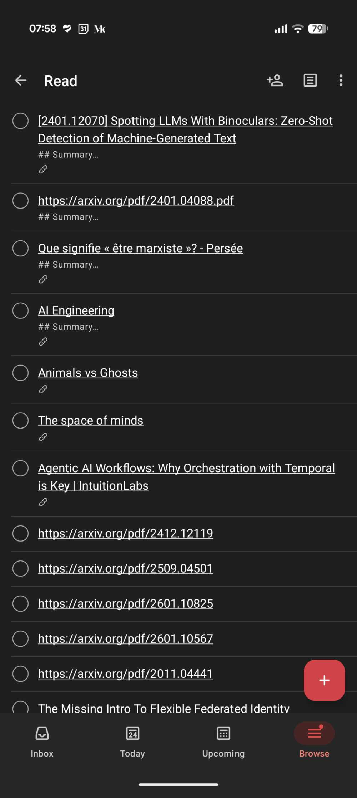
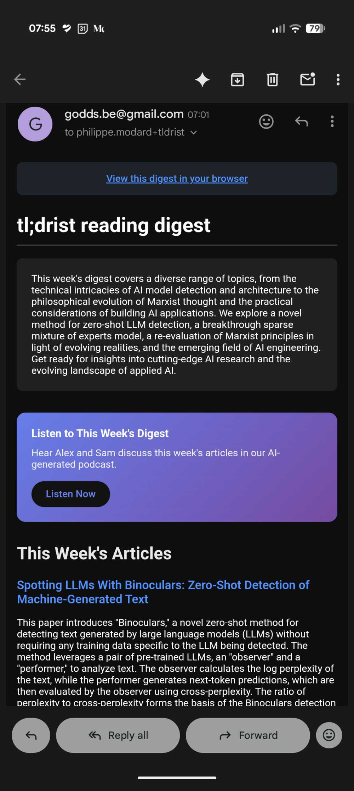
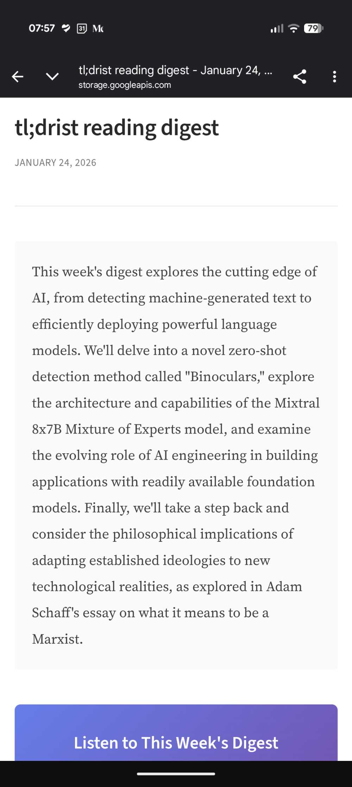

# TL;DRist

Daily digest of Todoist Read list articles summarized with Gemini.

## Example

| Todoist Read List | Email Digest | HTML Page |
|:-----------------:|:------------:|:---------:|
|  |  |  |

## Features

- Fetches articles from your Todoist "Read" project
- Extracts content using trafilatura and readability-lxml
- Generates summaries using Vertex AI Gemini 2.0 Flash
- Supports arXiv papers with PDF summarization and figure extraction
- Generates AI podcast conversations with Text-to-Speech audio
- Creates a responsive HTML web page of the digest
- Sends a daily digest email via Gmail SMTP
- Updates Todoist tasks with their summaries

## Setup

### Prerequisites

- Python 3.11+
- Google Cloud project with:
  - Vertex AI API enabled
  - Secret Manager API enabled
  - Cloud Run API enabled
  - Cloud Scheduler API enabled
  - Cloud Text-to-Speech API enabled (for podcast generation)
  - Cloud Storage bucket (for podcast audio and web pages)
- Todoist account with API token
- Gmail account with App Password

### Local Development

```bash
# Install dependencies
uv sync --extra dev

# Set environment variables
export TLDRIST_GCP_PROJECT_ID=your-project
export TLDRIST_GCP_REGION=europe-west1
export TLDRIST_GMAIL_ADDRESS=your-gmail@gmail.com
export TLDRIST_RECIPIENT_EMAIL=you@example.com
export TLDRIST_TODOIST_PROJECT_ID=your-project-id
export TLDRIST_GCS_IMAGES_BUCKET=your-bucket  # Optional: for podcast and web pages
export TLDRIST_SKIP_AUTH=true                 # Skip OIDC auth for local dev

# Run locally
uv run uvicorn tldrist.main:app --reload

# Test the endpoint
curl -X POST http://localhost:8000/api/v1/summarize?dry_run=true
```

### Development

Requires dev dependencies: `uv sync --extra dev`

```bash
uv run pytest              # Run tests
uv run ruff check .        # Lint
uv run ruff format .       # Format
uv run mypy src            # Type check
```

### Deployment

```bash
# Configure Terraform
cd terraform
cp terraform.tfvars.example terraform.tfvars
# Edit terraform.tfvars with your values

# Add secrets
gcloud secrets versions add todoist-token --data-file=- <<< "your-todoist-token"
gcloud secrets versions add gmail-app-password --data-file=- <<< "your-app-password"

# Deploy
terraform init
terraform apply
```

## API

### POST /api/v1/summarize

Triggers the article summarization workflow. Requires OIDC authentication (Cloud Scheduler token).

Query Parameters:
- `dry_run` (optional, default: false): Run without sending email or updating tasks
- `min` (optional): Minimum articles required; skips if fewer found
- `max` (optional): Maximum number of articles to process

Response includes: status, tasks found, articles processed/failed, email sent, and podcast URL.

### GET /api/v1/health

Health check endpoint. Returns status and version.

## License

MIT
